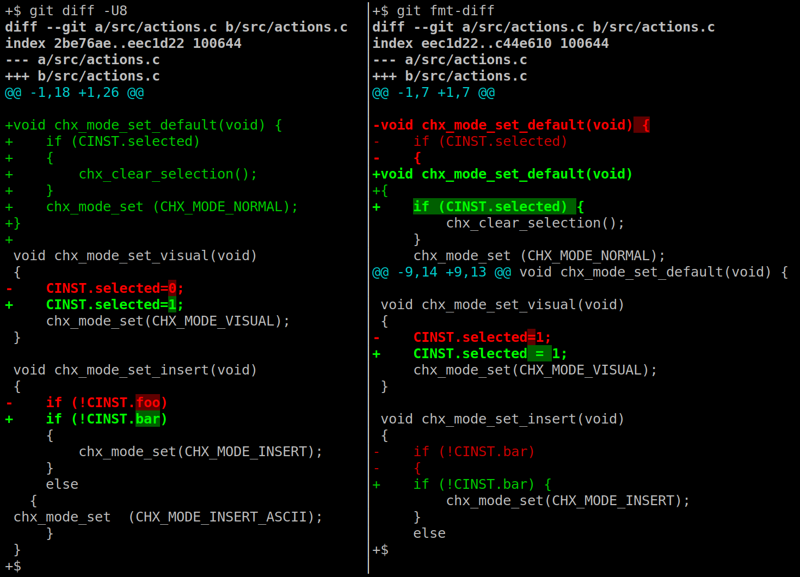

`git fmt-diff`
==============

[](https://www.codefactor.io/repository/github/jorengarenar/git-fmt-diff)
[](https://app.codacy.com/gh/Jorengarenar/git-fmt-diff/dashboard?utm_source=gh&utm_medium=referral&utm_content=&utm_campaign=Badge_grade)
[](https://aur.archlinux.org/packages/git-fmt-diff)

You inherited a huge codebase with thousands of commits?  
And it's an ugly mess? Now you cannot just reformat all those files?  
But you want to have future changes adhering to some sane style?  
Well, your formatter surely has some Git integration... it doesn't?  
In that case, you are in the right place!  

`git fmt-diff` shows how you could reformat just the lines touched in commits  
(similarly to tools like [git-clang-format](https://clang.llvm.org/docs/ClangFormat.html#git-integration), but you can use any formatter)



## Dependencies

* POSIX compatible shell (e.g. [Dash](http://gondor.apana.org.au/~herbert/dash/), [Bash](https://www.gnu.org/software/bash/), KornShell, [Git Bash for Windows](https://gitforwindows.org/))
* [Git](https://git-scm.com/)
* [Vim](https://www.vim.org/) _(optional)_ - for config-less filetype detection
* a formatter program of your choice

## Usage

See: [example usage scenario](scenario.md)

```
usage: git fmt-diff [<options>] [<commit>] [--] [<path>...]
   or: git fmt-diff [<options>] --cached [<commit>] [--] [<path>...]
   or: git fmt-diff [<options>] <commit>...<commit> [--] [<path>...]
   or: git fmt-diff [<options>] <blob> <blob>

options:
  -h                   display this help and exit
  --cached             view the changes you staged for the next commit relative
                       to the named <commit> (which defaults to HEAD)
  --staged             a synonym of --cached
  --color              always show colors
  --no-color           turn off colored diff
  --fmtprg-stderr      show stderr from formatter programs
  --warn-risky-stderr  redirects warning about potential unsolicited changes in suggestions to stderr;
                       option not recommended as the warning blocks dangerous 'git apply'
```

## Installation

1. Download [git-fmt-diff](https://raw.githubusercontent.com/Jorengarenar/git-fmt-diff/master/git-fmt-diff) file
2. Set it as executable: `$ chmod +x git-fmt-diff`
3. Put it into any directory listed in `$PATH` variable

## Configuration

Configuration follows the rest of Git configuration, example `~/.gitconfig`:
```gitconfig
# ... [user], [init] etc. ...

[fmt-diff]
    formatter-c = uncrustify -l C -c .uncrustify.cfg
    map-cpp = *.ipp, *.pp
    ignore = site-packages/*, *.sh

[fmt-diff "=python"]
    ignore = true       # ignoring all Python files

[fmt-diff "=go"]
    formatter = gofmt
#               ^-- a program from $PATH

[fmt-diff "tests/*"]
    ignore = true      # don't check files under tests/ dir

[fmt-diff "extern/*"]
    ignore = true      # ignore all files under extern/ dir ...

[fmt-diff "extern/lib/*.c"]
    ignore = false    # ... but do NOT ignore C files from extern/lib/ dir

[fmt-diff "tools/hex/*.c"]
    formatter = ! ARTISTIC_STYLE_OPTIONS= astyle -A3 -K
#               ^-- use sh expression

[fmt-diff "extern/cpp_lib/*.h"]
    ignore = false
    filetype = cpp
    formatter = ../ParentProj/.bin/astyle --indent=tab -A5
#               ^-- relative path to executable

# ... [alias], [include] etc. ...
```

* `[fmt-diff]` - general section
  * `formatter-filetype` - formatter command for files with type `filetype`
  * `map-filetype` - comma separated list of glob patterns to map files to `filetype`
  * `ignore` - comma separated list of globs to ignore
* `[fmt-diff "=filetype"]` - configuration for `filetype`
  * `formatter` - format command for this filetype
  * `ignore` - ignore formatting for this filetype (values: `true` or `false`)
* `[fmt-diff "path/to/*/smt/*"]` - configuration for files under glob
  * `filetype` - map files matching glob to this filetype
  * `formatter` - format command for files matching this glob
  * `ignore` - ignore formatting for files matching glob (values: `true` or `false`)

Your formatter command needs to read from stdio and write to stdout.  
That implies command needing to be filename agnostic!

First word in formatter command needs to be an executable (either from `$PATH` or a path to it).  
Before running the command, script checks whether it's possible using `test -x "$(command -v EXE)"`.  
You can use _sh_ expression instead if you start the command with `!`.

All paths are in relation to repository root.  
Globs in sections are primitive - relative path won't be handled correctly.
